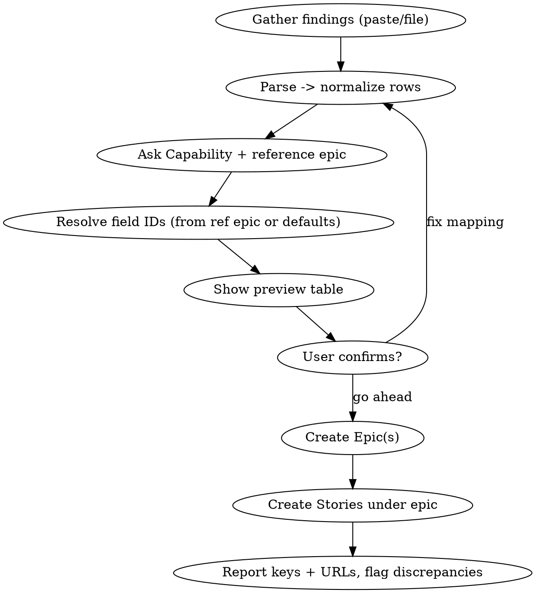

# Create FedRAMP Remediation Jira (Epic + Stories)

## Overview

Turns a spreadsheet of FedRAMP findings into Jira work items: **one Epic per service** under a
Capability the user names, and **one Story per finding row** under that Epic. All the fixed Cognigy
fields (see Field Policy) are applied automatically. The input may be pasted rows or a file, **with
or without a header row** — columns are inferred by content, and a preview is always confirmed
before anything is created.

Uses the Atlassian MCP tools (`mcp__claude_ai_Atlassian__*`). Jira project is **CSA** on
`nice-ce-cxone-prod.atlassian.net`.

## When to use

- "Create a FedRAMP epic and stories for `<service>`", "make CSA tickets from this sheet".
- The user pastes finding rows (any columns, any order, header or not) or gives a `.xlsx`/`.csv`/`.tsv` path.
- Follow-on to a `fedramp-codebase-assessment` scan when the findings need tracking tickets.

Not for: non-FedRAMP tickets, Azure DevOps work items (use `azure-devops-tickets`), or editing
existing issues in bulk.

## Required inputs — ask if missing

1. **Findings** — pasted rows or a file path. See Parsing.
2. **Capability key** — the parent the Epic is created under (e.g. `CSA-89851`). **Always ask** if not given.
3. **Reference epic key** *(optional but recommended)* — an existing FedRAMP epic (e.g. `CSA-91604`).
   Used to resolve field IDs/options and mirror formatting. **Always ask** whether one exists; if the
   user has none, fall back to the defaults in `references/field-map.md`.

Never invent a Capability or reference key. Ask.

## Workflow

1. **Gather** the findings. If a file: `.csv`/`.tsv` → Read directly; `.xlsx` → run
   `scripts/xlsx_to_tsv.py <path>` (falls back to asking the user to export CSV if the Python/openpyxl
   env is missing). If pasted: use the text as-is.
2. **Parse** into normalized rows using content inference (see Parsing). One logical **service** per Epic.
3. **Ask** for the Capability key and whether a reference epic exists.
4. **Resolve field IDs** — if a reference epic was given, `getJiraIssue` it with `fields:["*all"]` and copy
   its option IDs (Team Name, Epic Team, Component, Fix Version, Epic Type, NFR Type, Priority). Otherwise
   use `references/field-map.md` defaults. This keeps the skill working when IDs/versions change.
5. **Preview** — print a table (`Service | Finding ID | Control | Severity | Location | Story summary`)
   and the Epic summary. **Wait for explicit "go ahead".** Never create before confirmation.
6. **Get current user** — `atlassianUserInfo` → `account_id` (this is the assignee for Epic + all Stories).
7. **Create the Epic** (per service) — see `references/templates.md` for the description/acceptance-criteria
   template and `references/field-map.md` for the exact `createJiraIssue` field payload and gotchas.
8. **Create each Story** under the Epic (`parent` = new epic key).
9. **Report** a table of created keys + browse URLs. **Flag** any mismatch between the sheet's severity/ID
   and the repo's own `fedramp-codebase-assessment.md` if that file is accessible (don't block — just note it).

## Parsing — header-optional, content-based

Do **not** assume a header row or a fixed column count. Infer each column by value pattern; use header
names only as a hint when present. Cells may be blank or missing.

| Field (needed for) | Anchor pattern / rule |
| --- | --- |
| **Finding ID** *(required)* | `^[A-Z]{2,6}-[A-Z]{1,4}\d*-\d{2,4}$` — e.g. `GHL-RA5-001`, `GRMQ-SC8-002` |
| **Severity** | one of `CRITICAL / HIGH / MEDIUM / LOW / INFO` (case-insensitive) |
| **Control(s)** | NIST `^[A-Z]{2}-\d+(\(\d+\))?`, may be slash-joined (`SC-8 / SC-8(1) / SC-13`) |
| **Primary Control** | single NIST control (`RA-5`) |
| **Control Family** | bare 2-letter code (`RA`, `SC`, `AC`, `AU`, `SA`, `SI`, `CM`, `IA`, `CA`, `SR`) |
| **Location / File** | file path with `:line`, or `(repo-wide)` |
| **Service / Repo** *(required)* | kebab-case name (`go-health`, `service-nlp-classifier`) |
| **Description** | the longest free-text cell not matched above |
| Area / Category / Team / Developer / Confluence link | informational; matched loosely, safe to omit |

Resolution order:
1. **Header present** → map by name (synonyms: `Repo`≈`Service`≈`Repository`; `Location`≈`File`≈`Evidence`;
   `Control(s)`≈`Controls`), then sanity-check each column against its pattern above.
2. **No header** → infer purely from value patterns, column by column.
3. **Ambiguous/conflicting** → ask the user about *that column only*, not the whole input.

**Minimum per row:** a `Finding ID` and at least one of (`Description` / `Control`). Everything else degrades.
If the service can't be inferred from any row, ask for it once (applies to all rows).

If rows span **multiple services**, create one Epic per service and confirm the split in the preview.

## Field Policy (applied automatically)

Baked-in unless a reference epic overrides the option IDs:

| Field | Value |
| --- | --- |
| Project / issue types | `CSA` · Epic + Story |
| Sprint | **blank** (never set) |
| Assignee | **current user** (`atlassianUserInfo`) — Epic + every Story |
| Story Points | **1** per Story (`customfield_10038`) |
| Priority | **P1** |
| Fix version | **26.4** |
| Team Name | **Analytics Zenith** (`customfield_10098`) |
| Epic Team | **Analytics Zenith** (`customfield_10040`, **array**) |
| Component | **Cognigy AI** |
| Epic Type | **NFR** (`customfield_11577`) |
| NFR Type | **Security - Static Code** (`customfield_11578`) |
| Labels | `fedramp`, `<service>`, `security` |
| Epic parent | the Capability key the user gave |
| Story parent | the newly created Epic |

Exact field IDs, option IDs, and the `createJiraIssue` payload shape live in
`references/field-map.md`. Description/acceptance-criteria templates live in `references/templates.md`.

## Story & Epic summaries

- **Story summary:** `<SEVERITY> - <FINDING-ID> - <concise Title>`. Derive the Title from the Description
  (short, Title Case) — do not dump the full Description into the summary; it goes in the body.
- **Epic summary:** `Cognigy FedRAMP - <service> remediations`.

## Common mistakes (learned)

- **Epic Team must be an array**: `customfield_10040: [{"id": "..."}]` — a bare object errors with
  *"Specify the value for Epic Team in an array"*.
- **Epic requires** Acceptance Criteria (`customfield_10039`, **ADF doc** — not markdown), Epic Team, and
  Epic Type. Missing any → create fails.
- **Epic Type = NFR makes NFR Type mandatory** (`customfield_11578`). Set both together.
- **Rich-text custom fields need ADF** when passed in `additional_fields`; the `description` param can stay
  markdown via `contentFormat: "markdown"`.
- **Don't create before the preview is confirmed.** Header-absent/partial input is exactly when a silent
  misparse creates wrong tickets.
- **Don't hardcode blindly** — prefer resolving option IDs from the reference epic; the defaults are a
  fallback and drift over time (fix versions especially).
- **Flag, don't silently "correct", severity/ID mismatches** between the sheet and a repo's own assessment.
